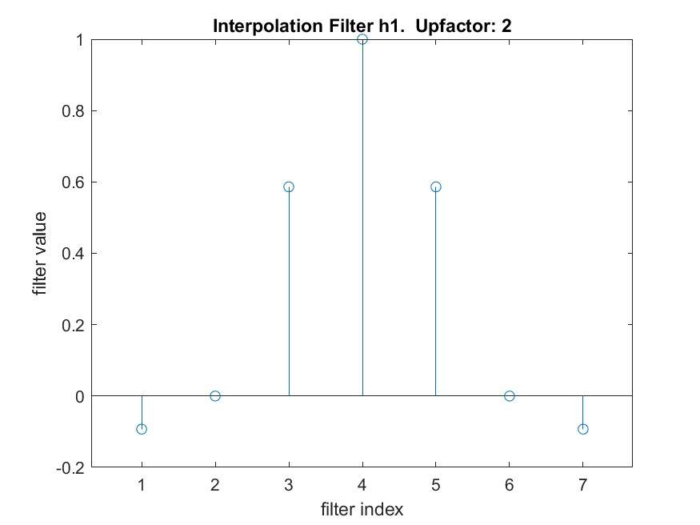
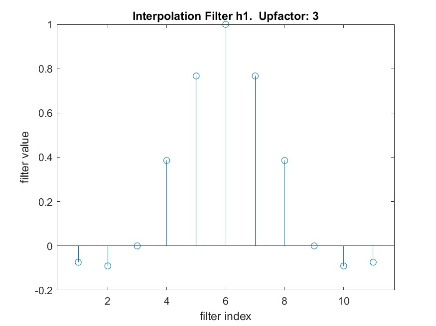
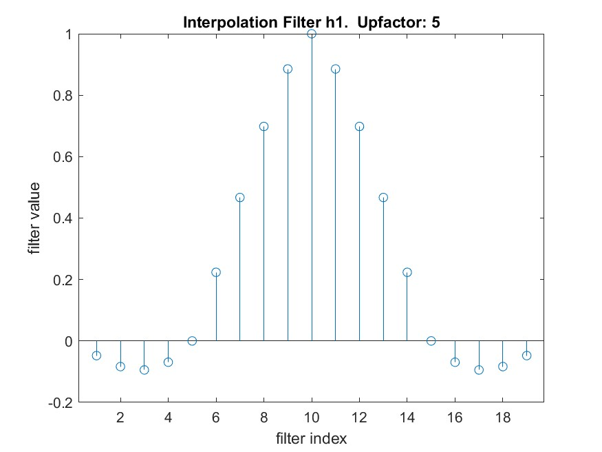
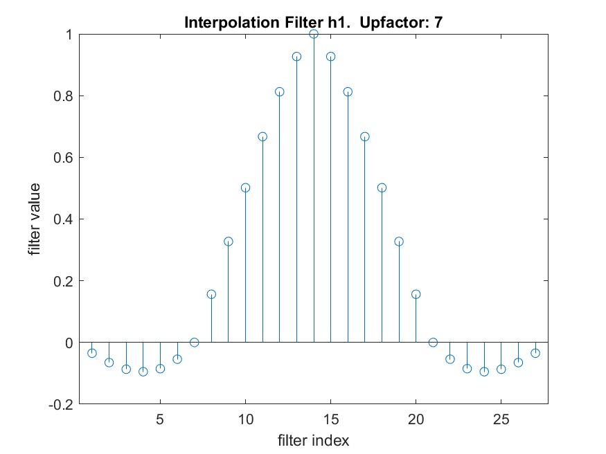

# Cuda At Scale Independent Project

For this project I decided to implement interpolation using CUDA.  Why interpolation?  Interpolation is useful in its own right.  At the same time once interpolation has been implemented it is not to difficult to do decimation, correlation, and filtering.

I believe the intention of the project was to use the NPP library.  My plan was to use nppsMul_32f to multiply the input by the interpolation filter, then use nppsIntegral_32s_Ctx to accumulate the results.  The problem was that I needed an accumulation function that worked with float's and nppsIntegral_32s_Ctx only accepts 32-bit signed integers.  I could have made my own kernel to accumulate float's, but that not be in the spirit of using CUDA libraries.  As an alternative I used cublasSdot for the accumulation.

### Methodology

The methodology of the project:
- Implement the interpolation algorithm in Matlab
- Create test vectors using Matlab
- Create functions to perform interpolation in CUDA
- Verify the CUDA functions in a Unit Test environment
- Write the code for the interpolation application that makes use of the CUDA functions

### Algorithm

The interpolation algorithm chosen to implement was the most naive one to implement.  The naive algorithm is upsampling (i.e. inserting zeros between samples) and then applying a low pass filter.  Before starting the project I already knew of algorithms that are better computationally.  So why start with a naive approach?  The first reason is because it is a good engineering practice to get something working first and optimize later.  The second reason is that once you start optimizing you will have the naive algorithm to bench mark against.  

#### Upsample
A kernel was made to do the upsample by inserting N-1 zeros between the input samples.  Where N is the upsample factor.  See upsample.cu for implementation details.

#### Low Pass Filter
I used Matlab to create the low pass filter.  Below are graphs of the low pass filters.









#### Interpolation
Interpolation make use of the umsample kernel and cublasSdot().

### Results
I did make a test input signal with 50e6 sample to be interpolate by 7.  In Matlab it took about 23 seconds to finish.  When I tried the same input signal in this application it never finished!  Lesson learned is that nothing beats a superior algorithm.  

My understanding is that Matlab uses the FFT Convolution algorithm.  See https://www.analog.com/media/en/technical-documentation/dsp-book/dsp_book_ch18.pdf for description of FFT Convolution.

### Next Steps
For the next steps I would explore other interpolation algorithms.  Two possible candidates are the FFT Convolution method and poly phase filters.

## Commands to make the project:

```
git clone git@github.com:JasonDChistensen/CudaAtScaleIndependentProject.git
cd CudaAtScaleIndependentProject
git submodule update --init --recursive
make
```
## Commands to run the executable:
```
cudaAtScaleIndependentProject.exe <output file> <input file> <interpolation factor>
```
### Example:
```
./cudaAtScaleIndependentProject.exe interpolatedSignal2.bin tests/vectors/inputSignal2.bin 2
```

## Commands to time the executable:
```
time cudaAtScaleIndependentProject.exe <output file> <input file> <interpolation factor>
```


## Commands to make the unit tests:

```
cd tests
make
```

## Commands to run the unit tests:
```
./cudaAtScaleTests.exe
```

## Reference:

https://docs.nvidia.com/cuda/cuda-c-programming-guide/

https://docs.nvidia.com/cuda-libraries/index.html

https://docs.nvidia.com/cuda/npp/index.html

https://docs.nvidia.com/cuda/npp/signal_filtering_functions.html

https://docs.nvidia.com/cuda/cublas/

https://www.analog.com/media/en/technical-documentation/dsp-book/dsp_book_ch18.pdf

Setting up Visual Studio for debugging: https://docs.nvidia.com/nsight-visual-studio-code-edition/cuda-debugger/index.html

Preview .md file side-by-side in Visual Studio: (Ctrl+K V)

